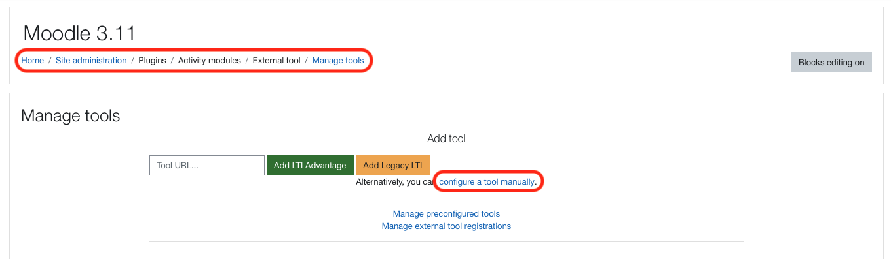
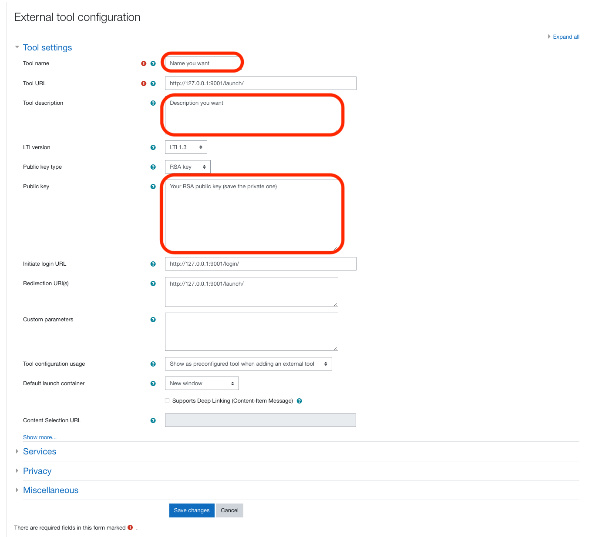
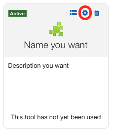
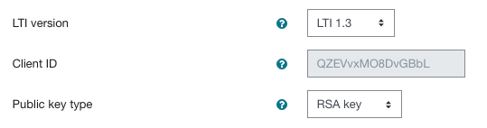
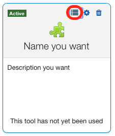
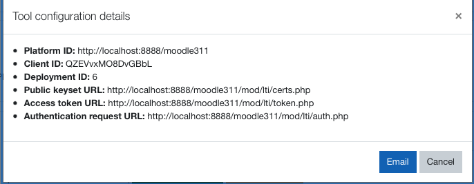

#  FIB-TFG: Nexus

Nexus és una aplicació de compartició d'apunts amb integració a qualsevol LMS (Learning System Management) que suporti LTI 1.3.

[PyLTI1p3](https://github.com/dmitry-viskov/pylti1.3) és una implementació de Python per la eina LTI 1.3 Advantage Tool, la qual ens permetrà connectar-nos amb facilitat a un LMS que suporti LTI 1.3.
## Clonar repositori a la teva màquina
```ssh
git clone https://github.com/julsgasull/FIB-TFG.git
```
Alguns canvis seran requerits per poder configurar l'eina al teu LMS. Seràn explicats més endevant.

## Configuració de l'eina
Per tal de configurar l'eina amb un LMS que no sigui Moodle, mirar la següent [documentació](https://github.com/dmitry-viskov/pylti1.3-django-example/blob/master/README.rst). En cas contrari, seguir llegint.

### Configuració des de Moodle
* Amb permís d'administrador, anar a `Site Adminstration / Plugins / Activity modules / External tool / Manage tools `.
* Allà, clicar `configure a tool manually`, tal i com mostra la següent imatge.
  * 
* Ara, omple els espais de la següent manera, recordant que els espais marcats els has d'omplir amb la teva informació. (Per l'apartat Public key, has de generar una clau pública i una privada a la teva màquina o [aquí](https://cryptotools.net/rsagen). Recorda guardar tant la pública com la privada dins de `/source/configs/`.
  * 
* Clicar `Save Changes`.

* Un cop guardat, anar, dins del repositori clonat a `source/configs/app.json`. Veuràs una cosa com aquesta:
```json
{
    "http://localhost:8888/moodle311" : [{
        "default": true,
        "client_id" : "zM5SDfwGaSTLMy9",
        "deployment_ids" : ["5"],
        "auth_token_url" : "http://localhost:8888/moodle311/mod/lti/token.php",
        "auth_login_url" : "http://localhost:8888/moodle311/mod/lti/auth.php",
        "auth_audience": null,
        "key_set": {
            "keys": [
                {
                    "kty": "RSA",
                    "alg": "RS256",
                    "kid": "0a67ee940ba497ed72d9",
                    "e": "AQAB",
                    "n": "xuJSF4-X_jovLMEthnd2y_iMwolDCq3Zoks1vp7udVfIDIgApi5qq3F7Wt76n7JBakNtOK7L6F2O1B1qYAxdQXkCQoJdLszaYUR4i5vs01dza29EbFWA4_8-fStPTTxJe-uHFq0apkMbEKOFI75nI8P63KVmIJnahbOS_TzMLd9a8aBndGvuLcLdL68ae3AbJ9yHkmNhAoUn_3eDrmVRVSQW8SvVFimV579mDKk3iZFk42IOZELUkXHfI3gqKtgbgIgKa8Y_0MbDuTFJusm-jupYT-82JaA1DH3YS9Y0lzfPRct51YPdwUuYUwV_HzLAvAr2mAIVP9gzfRS6ZGYFOQ",
                    "use": "sig"
                }
            ]
        },
        "private_key_file" : "private.key",
        "public_key_file": "public.key"
    }]
}
```
* Has de canviar els paràmetres desitjats, de la següent manera:
  * `http://localhost:8888/moodle311` representa l'issuer, és a dir, el link del teu LMS. Per exemple, `http://atenea.upc.edu/`.
  * `client_id` el trobaràs intentant editar altre cop l'eina que has acabat de configurar. En aques cas és `QZEVvxMO8DvGBbL`.
    * , 
  * `deploymeet_ids`: el trobaràs intentant veure l'informació de l'que has acabat de configurar. En aques cas és `["6"]`.
    *  , 
  *  `auth_token_url`: el trobaràs igual que l'anterior. En aquest cas és `http://localhost:8888/moodle311/mod/lti/token.php`,
  *  `auth_login_url`: el trobaràs igual que l'anterior. En aquest cas és `http://localhost:8888/moodle311/mod/lti/auth.php`,
  *  `key_set`: per arribar-hi, has de seguir el mateix format de link que els anteriors. En aquest cas, seria `http://localhost:8888/moodle311/mod/lti/certs.php`. Si el link que moodle et dona normalment fos `http://atenea.upc.edu/mod/lti/X.php`, llavors hauries d'anar a `http://atenea.upc.edu/mod/lti/X.php`.
  *  `private_key_file` i `public_key_file`: abans els has guardat a `/source/configs/`, només hi has de posar el path.
  *  La resta de paràmetres deixa'ls així.

Ara, a moodle, tan sols has d'afegir la tool que has creat a qualsevol curs on la vulguis. Per tal que funcioni, fes el següent:
```ssh
cd source
docker-compose up --build
```
Deixa que es faci tota la build (trigarà una mica, sobretot per la llibreria numpy). Un cop acabada, ja pots utilitzar la eina afegida al teu moodle!